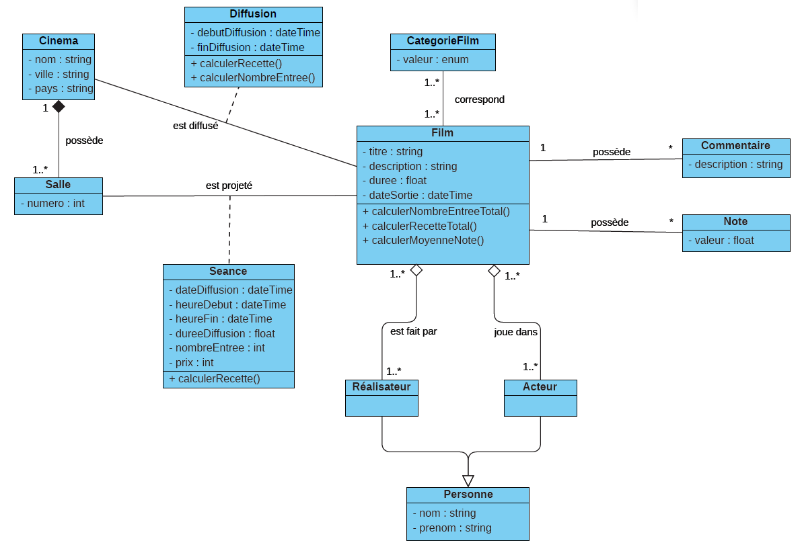
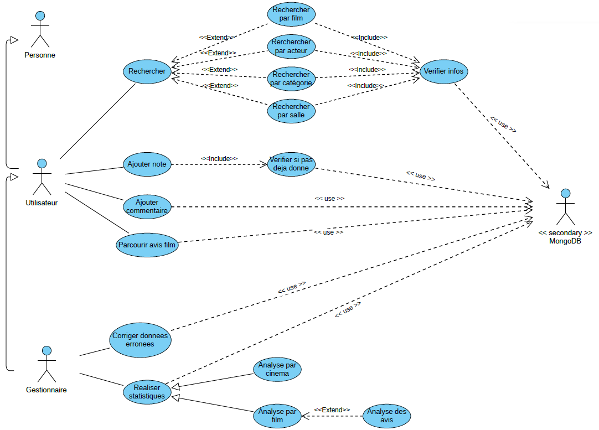
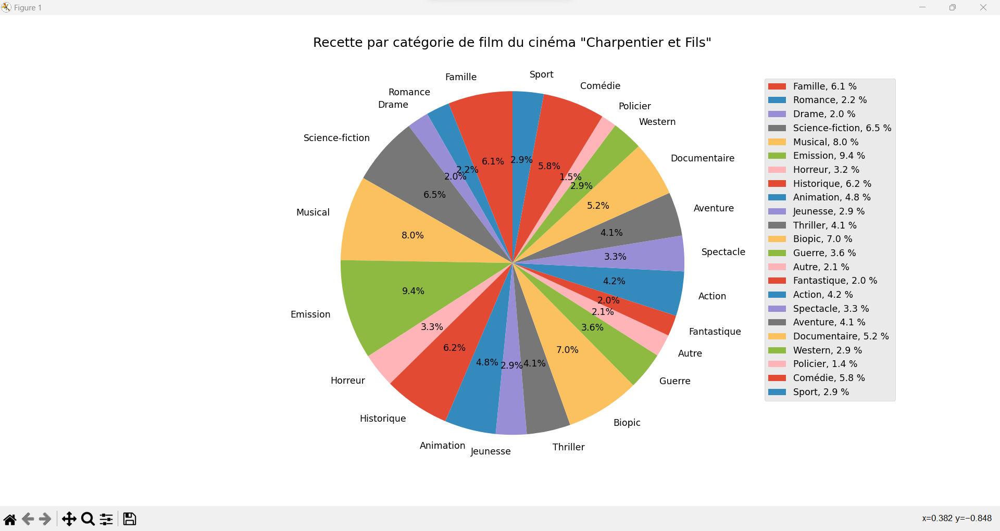
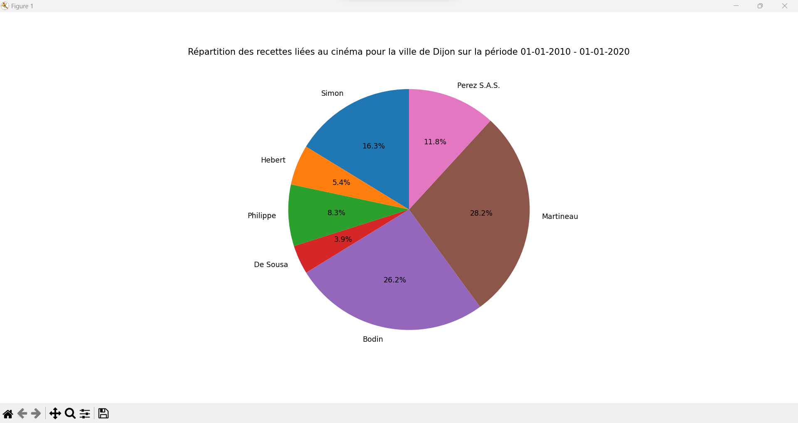
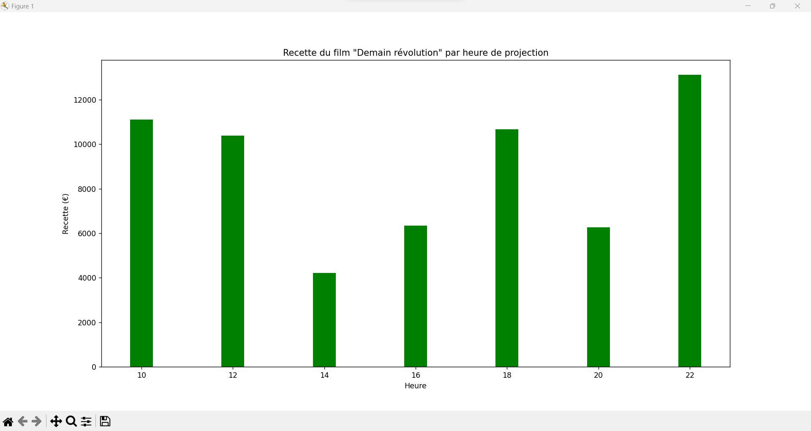
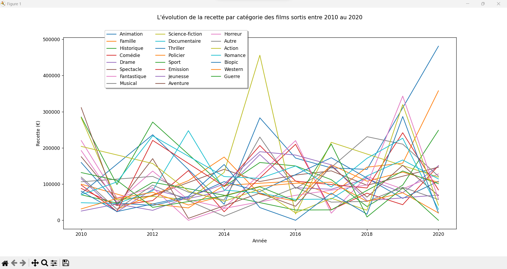
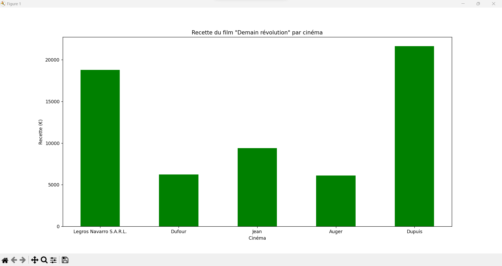

# MongoDB with PyMongo - films and cinemas database

## Table of contents

- [Description](#description)
- [Project structure](#project-structure)
- [How to populate the database](#how-to-populate-the-database)
- [How to run the MongoDB queries](#how-to-run-the-mongodb-queries)
- [How to run the PyMongo queries](#how-to-run-the-pymongo-queries)
- [Examples of graphs](#examples-of-graphs)
- [Authors](#authors)

## Description

This is a simple project to learn how to use MongoDB with PyMongo. The project consists of a database of films and cinemas. The database is created using MongoDB and the data is inserted using PyMongo.
The objective of the project is to implement a database to allow users and administrators to interact with it. The users can search for films and cinemas, and the administrators can add new films and cinemas to the database.
We also added some statistics query allow the administrators to get some information about the films and cinemas in the database.

## Project structure

The project is structured in the following way:

- `data/`: contains the data used to populate the database and the json schema used to validate the data
- `mongoDB/`: contains all queries writed without PyMongo, only using MongoDB. 
    - `aggregate/`: contains all queries using the aggregate framework.
    - `map-reduce/`: contains all queries using the mapReduce framework.
    - `find/`: contains all queries using the find framework.
    - `crud/`: contains all queries using the CRUD framework.
        - `categories/`: contains all queries related to the categories collection.
        - `cinemas/`: contains all queries related to the cinemas collection.
        - `films/`: contains all queries related to the films collection.
- `pymongo/`: contains all queries writed using PyMongo.
- `utils/`: contains some classes to help the development of the project. 
    - `factory/`: contains the factory classes used to create the objects of the database and the database itself.
    - `MongoDB/`: contains the classes used to interact with the database.
    - `DotEnv/`: contains the class used to read the .env file.
- `.env`: contains the environment variables used in the project.


## How to populate the database

You need to place yourself in the utils/factory directory and run the following command:

```bash
py actors_producer.py
py categories.py
py films.py
py cinemas.py
py films-update.py
py categories-update.py
py Main.py
```

That will populate the database with the data in the data directory. You will obtain three collections :

- cinemas
- films
- categories

Here is the schema of the database and a use case diagram to understand the database and the features we implemented.





## How to run the MongoDB queries

We used the extension MongoDB for VSCode to run the queries. You can find the extension [here](https://marketplace.visualstudio.com/items?itemName=mongodb.mongodb-vscode).

With this extension you only need to open the file with the query and click on the play button. Otherwise you can use the mongo shell to run the queries. Just open the mongo shell and copy-paste the query on the shell.

## How to run the PyMongo queries

You need to place yourself in the pymongo directory and so you can run each query. 

You may need to install the pymongo library. You can do it with the following command:

```bash
pip install pymongo
```

You also may need to install the matplotlib library. You can do it with the following command:

```bash
pip install matplotlib
```

That's because we show some graphs for the statistics queries.

## Examples of graphs

Here are some examples of graphs we show in the statistics queries.












## Authors

- [Maxime Dupont](https://github.com/maxime-dupont01)
- [Christian Tomasino](https://github.com/ChrisTom-94)